# KEYSTONE User Guide

A complete walkthrough of every page and feature in KEYSTONE — the USMC Logistics Common Operating Picture.

---

## Table of Contents

1. [Getting Started](#getting-started)
2. [Logging In](#logging-in)
3. [Dashboard](#dashboard)
4. [Map View](#map-view)
5. [Readiness](#readiness)
6. [Supply Status](#supply-status)
7. [Equipment Readiness](#equipment-readiness)
8. [Maintenance Management](#maintenance-management)
9. [Requisitions](#requisitions)
10. [Fuel / POL Management](#fuel--pol-management)
11. [Transportation](#transportation)
12. [Chain of Custody](#chain-of-custody)
13. [Personnel](#personnel)
14. [Medical Readiness](#medical-readiness)
15. [Data Ingestion](#data-ingestion)
16. [Data Sources](#data-sources)
17. [Reports](#reports)
18. [Alerts & Notifications](#alerts--notifications)
19. [Audit Log](#audit-log)
20. [Administration](#administration)
21. [Documentation](#documentation)
22. [Profile & Preferences](#profile--preferences)
23. [Keyboard Shortcuts](#keyboard-shortcuts)
24. [Troubleshooting](#troubleshooting)

---

## Getting Started

### Installation

Run the one-command installer from the project root:

```bash
git clone https://github.com/morbidsteve/keystone.git
cd keystone
./install.sh
```

Options:
- `./install.sh` — Build and start all services
- `./install.sh --demo` — Start with the simulator generating live data
- `./install.sh --stop` — Stop all services (preserves data)
- `./install.sh --reset` — Destroy all data and rebuild from scratch
- `./install.sh --status` — Check service health

### Requirements

- Docker Engine 24+ with Docker Compose v2
- 4 GB RAM minimum (8 GB recommended)
- Ports 443 (HTTPS), 8000 (API), 5432 (PostgreSQL), 6379 (Redis)

### Access

Once running, open **https://localhost** in your browser. Accept the self-signed certificate warning (Advanced → Proceed to localhost).

---

## Logging In

KEYSTONE ships with 7 development accounts covering every role:

| Username | Password | Role | Unit |
|----------|----------|------|------|
| `admin` | `admin123` | System Administrator | I MEF |
| `commander` | `cmd123` | Battalion Commander | 1st MarDiv |
| `s4officer` | `s4pass123` | S-4 Logistics Officer | 1st Marines |
| `s3officer` | `s3pass123` | S-3 Operations Officer | 1st Marines |
| `operator` | `op123` | Logistics Operator | 1/1 |
| `armorer` | `arm123` | Unit Armorer | A Co 1/1 |
| `viewer` | `view123` | Read-Only Viewer | A Co 1/1 |

In **Demo Mode**, a role-picker login page presents 24 named users organized by command element. Pick any card to explore that role's perspective.


---

## Dashboard

The dashboard is the first thing you see after login. It provides a 30-second readiness assessment of the force.

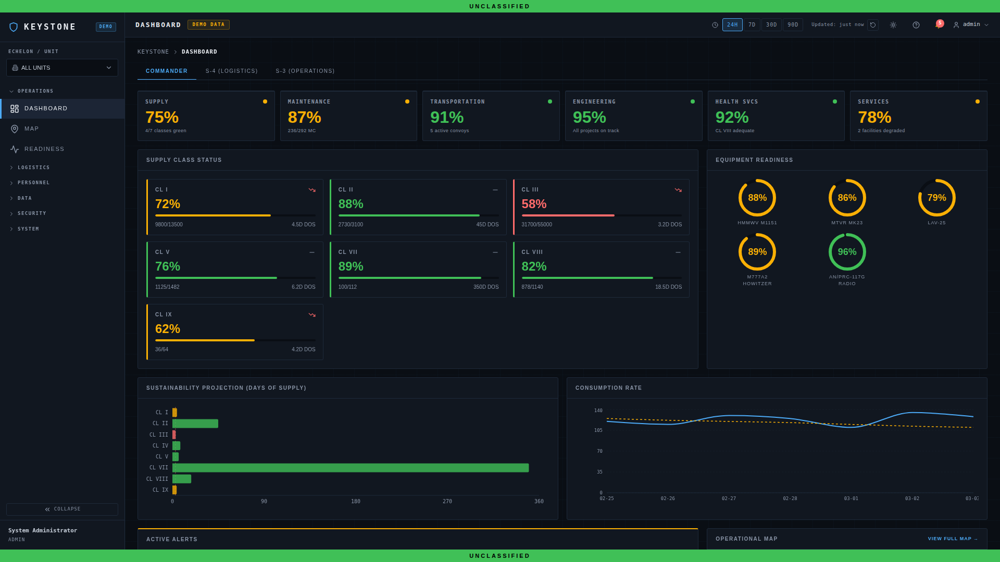

### What You See

- **6 Readiness KPI Cards** — Supply, Maintenance, Transportation, Engineering, Health Services, Services — each color-coded GREEN/AMBER/RED with a percentage and summary
- **Supply Class Status** — Every NATO supply class (CL I through CL IX) with on-hand vs. required, percentage bars, and days-of-supply
- **Equipment Readiness** — Donut charts for key platforms (HMMWV, MTVR, LAV-25, M777, AN/PRC-117G) showing mission-capable percentage
- **Sustainability Projection** — Horizontal bar chart showing projected days of supply by class
- **Consumption Rate** — 7-day trend line of overall consumption
- **Active Alerts** — Critical and warning alerts requiring acknowledgement
- **Operational Map** — Mini map showing unit positions and convoy routes
- **Activity Feed** — Live stream of requisitions, work orders, convoys, supply updates, alerts, personnel actions, and reports

### Role Tabs

Switch between three perspectives using the tabs at the top:

#### S-4 (Logistics) View

The S-4 view shows a detailed supply status table with every supply class across every subordinate unit — on-hand quantities, fill percentages, days-of-supply, and consumption rates.

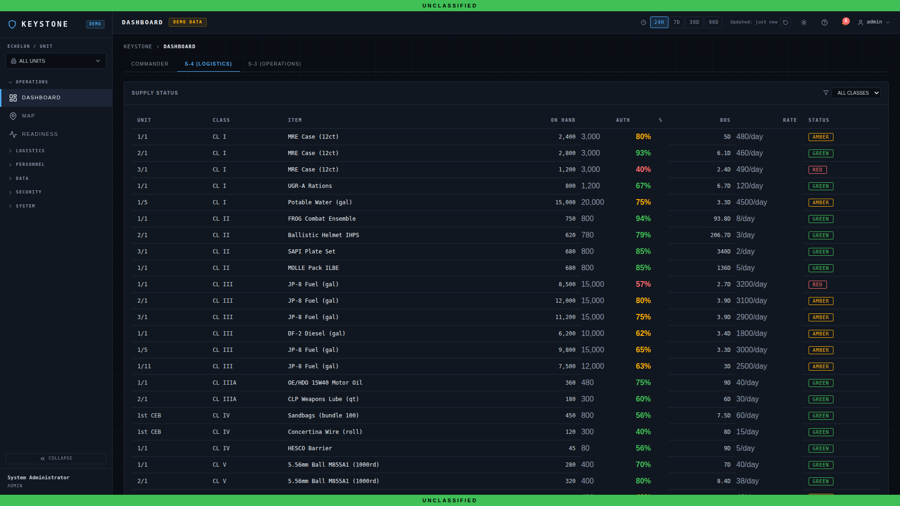

#### S-3 (Operations) View

The S-3 view focuses on operational sustainability — unit cards with readiness percentages, sustainability in days, supply DOS bars, and operational constraints. Below that, movement route status shows MSR/ASR conditions.

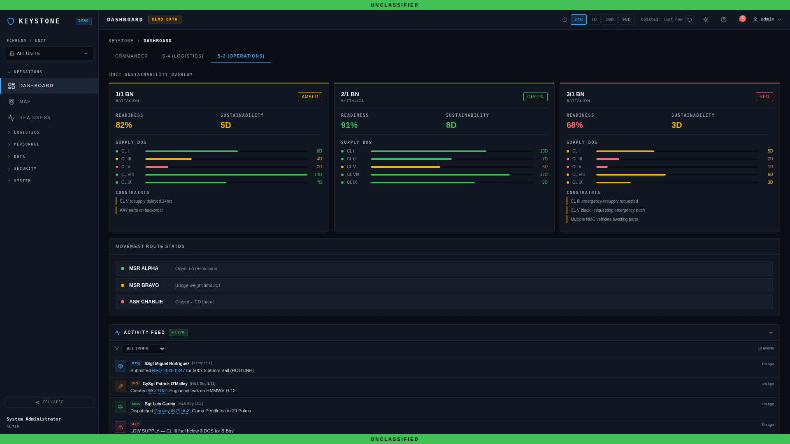

### Time Range Selector

Use the **24H / 7D / 30D / 90D** buttons in the header to filter data across all dashboard widgets. On mobile, this appears as a dropdown.

---

## Map View

The interactive map plots every unit, supply point, convoy route, and logistics node on a Leaflet-based map with proper military symbology (APP-6D SIDCs).

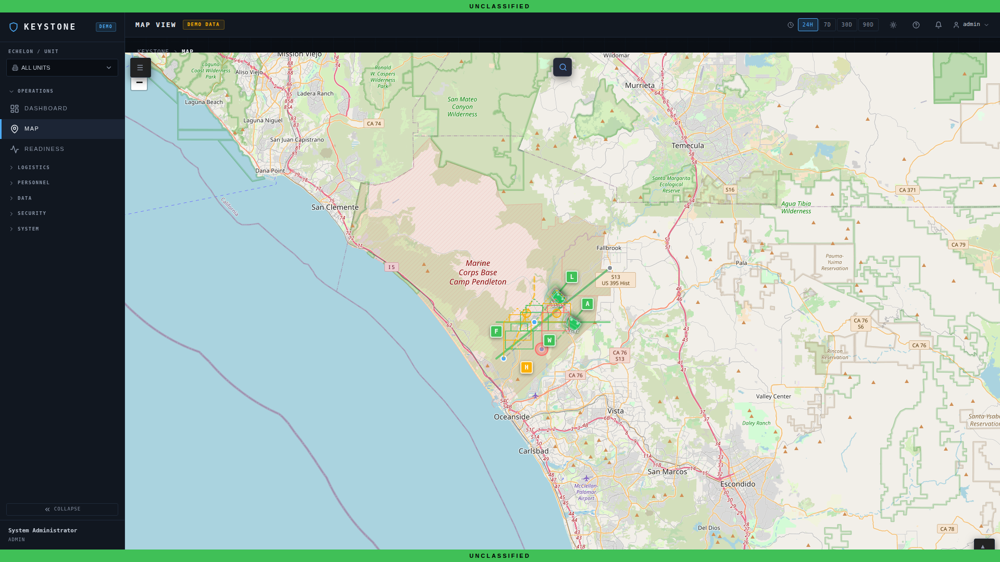

### Features

- **Three base maps**: OpenStreetMap, satellite imagery, topographic
- **8 toggleable layers**: Unit positions, supply points, convoy routes, MSRs/ASRs, and more
- **Click any unit** to see supply status, equipment readiness, and inbound convoys
- **Click any supply point** to see type, status, operating unit, and GPS/MGRS coordinates
- **Cursor coordinates** displayed in both lat/lon and MGRS at the bottom
- **Distance measurement tool** for planning
- **Tile proxy** supports offline/air-gapped operation

---

## Readiness

A DRRS-style readiness assessment showing C-level ratings across the force.

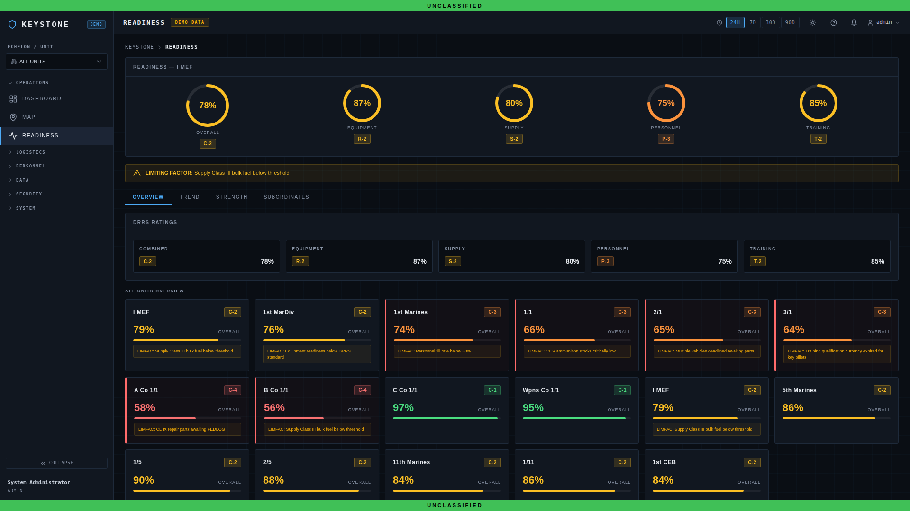

### What You See

- **5 Donut Gauges**: Overall, Equipment, Supply, Personnel, Training — each with a C-rating (C1–C4)
- **Limiting Factor Banner**: Highlights the specific item dragging readiness down (e.g., "CL III Bulk Fuel")
- **All-Units Overview**: Grid comparing every subordinate unit's readiness side by side with color-coded percentage bars

---

## Supply Status

Track all 10 NATO supply classes with detailed metrics.

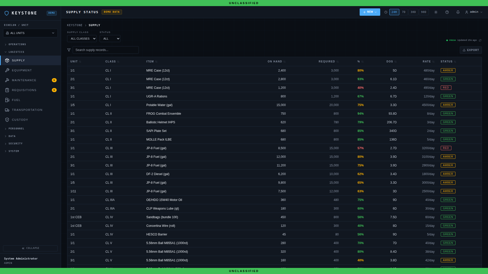

### Features

- **Traffic-light status** (GREEN/AMBER/RED) based on days-of-supply thresholds
- **Sortable columns**: Unit, supply class, on-hand, required, percentage, DOS, consumption rate
- **Filter by class and unit** using the dropdowns at the top
- **Search** across all supply items
- **Export** data for reports or higher HQ submission

---

## Equipment Readiness

Fleet-level readiness by equipment type with maintenance integration.

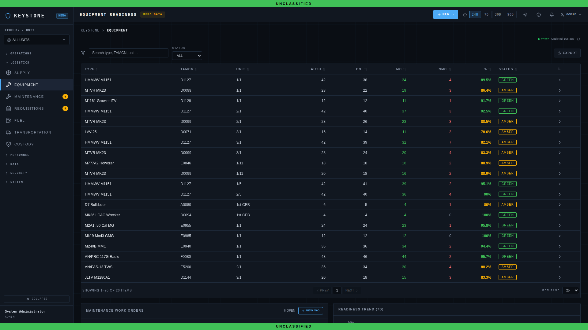

### Features

- **Readiness bars** color-coded by percentage threshold
- **Authorized vs. On-hand vs. Mission Capable** counts per equipment type
- **Fault tracking** with severity levels (safety, deadline, minor)
- **Click any equipment type** to drill down to individual vehicles with serial/bumper numbers
- **7-day readiness trend chart** showing improvement or decline

---

## Maintenance Management

Full lifecycle work order tracking from creation to completion.

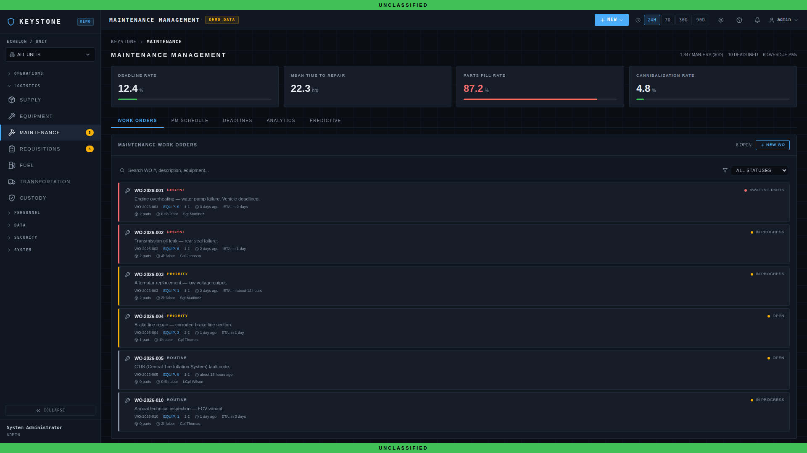

### KPI Cards

- **Deadline Rate** — Percentage of fleet that is NMC
- **MTTR** — Mean Time To Repair in hours
- **Parts Fill Rate** — Percentage of parts requests fulfilled
- **Cannibalization Rate** — Parts sourced from other vehicles

### Work Order Lifecycle

OPEN → IN_PROGRESS → WAITING_PARTS → COMPLETE

Each card shows priority (URGENT/PRIORITY/ROUTINE), equipment, fault description, assigned mechanic, and parts status.

### Tabs

- **Work Orders** — Active jobs
- **PM Schedule** — Preventive maintenance calendar
- **Deadlines** — NMC equipment requiring immediate action
- **Analytics** — Readiness trends, MTBF calculations
- **Predictive** — ML-based failure predictions

---

## Requisitions

Submit supply requisitions and track them through the approval workflow.

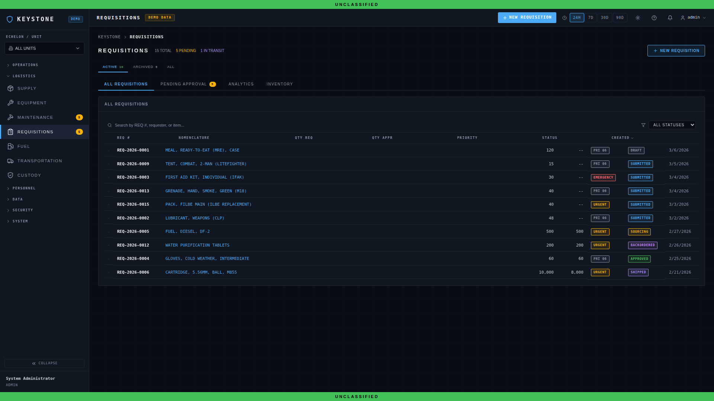

### Workflow

1. **Submit** a requisition with priority (EMERGENCY/URGENT/PRIORITY/ROUTINE), items, and quantities
2. Track through **SUBMITTED → APPROVED → SHIPPED → FULFILLED** or **REJECTED**
3. **Status filter tabs** let you focus on any stage
4. Each card shows requisition number, requesting unit, items, and approval chain

---

## Fuel / POL Management

Monitor fuel storage, consumption, and forecast resupply needs.

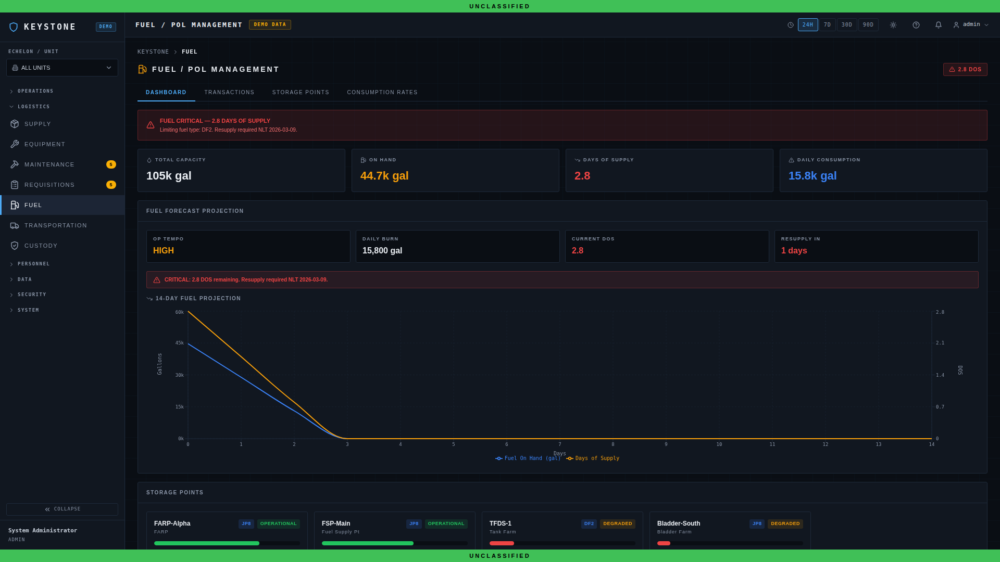

### Features

- **Critical warning banner** when any storage point falls below threshold
- **KPI Cards**: Total Capacity, On Hand, Days of Supply, Daily Consumption
- **Storage point cards** with fuel type, fill percentage bars, and MGRS coordinates
- **14-day projection chart** forecasting when you'll run dry
- **Transaction tracking** for receipts and issues

---

## Transportation

Hub for all movement operations — convoys, movements, lift requests, and history.

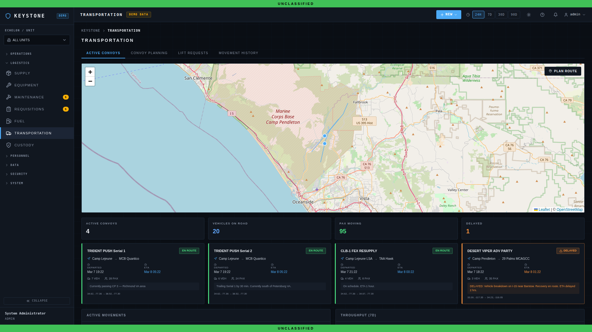

### Tabs

- **Active Convoys** — Map view with convoy positions and status cards
- **Active Movements** — List of all movements in progress (LOGPAC, MEDEVAC, equipment recovery)
- **Convoy Planning** — Plans in DRAFT/SUBMITTED/APPROVED/EXECUTING stages
- **Lift Requests** — Kanban board tracking requests through lifecycle
- **Movement History** — Completed movements with on-time performance

### Convoy Planning

Open any plan to define serials, assign crews, set movement timelines, and build the operations order. Each plan includes communications, recovery, and MEDEVAC sub-plans.

---

## Chain of Custody

Register and track every sensitive item — weapons, optics, NVGs, crypto, radios, COMSEC, explosives.

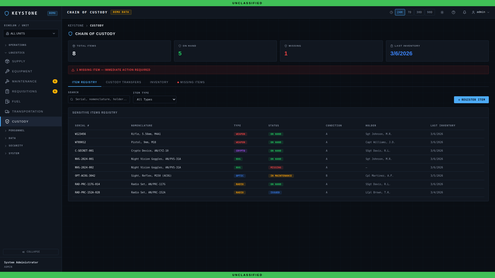

### Features

- **Item Registry** — All items with serial numbers, type badges, status (ON HAND/MISSING/IN MAINTENANCE/ISSUED), condition, and current holder
- **Missing Item Alerts** — Immediate action banner when items are unaccounted for
- **Register New Items** — Full form with serial, nomenclature, type, NSN, classification, condition code
- **Custody Transfers** — Issue, turn-in, lateral transfer, temporary loan with full audit trail
- **Inventory Events** — Track cyclic, sensitive item, and monthly inventories

---

## Personnel

Manning strength and individual Marine tracking.

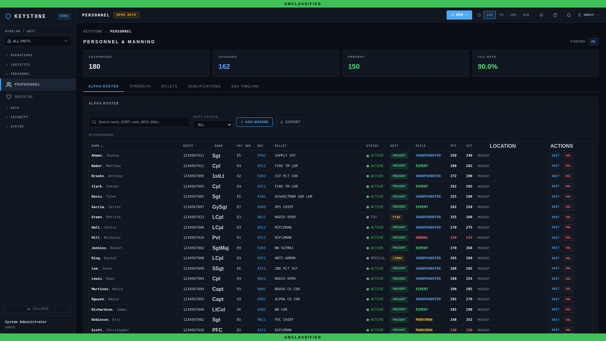

### Features

- **Strength Summary**: Authorized, Assigned, Present with fill rate and P-Rating
- **Alpha Roster**: Searchable table with Name, EDIPI, Rank, MOS, Billet, Status, Duty, Rifle Qual, PFT/CFT, Location
- **Tabs**: Strength, Billets, Qualifications, EAS Timeline
- **Status tracking**: Present, Deployed, Leave, TAD, Medical, UA

---

## Medical Readiness

CASEVAC tracking, medical facilities, and blood product inventory.

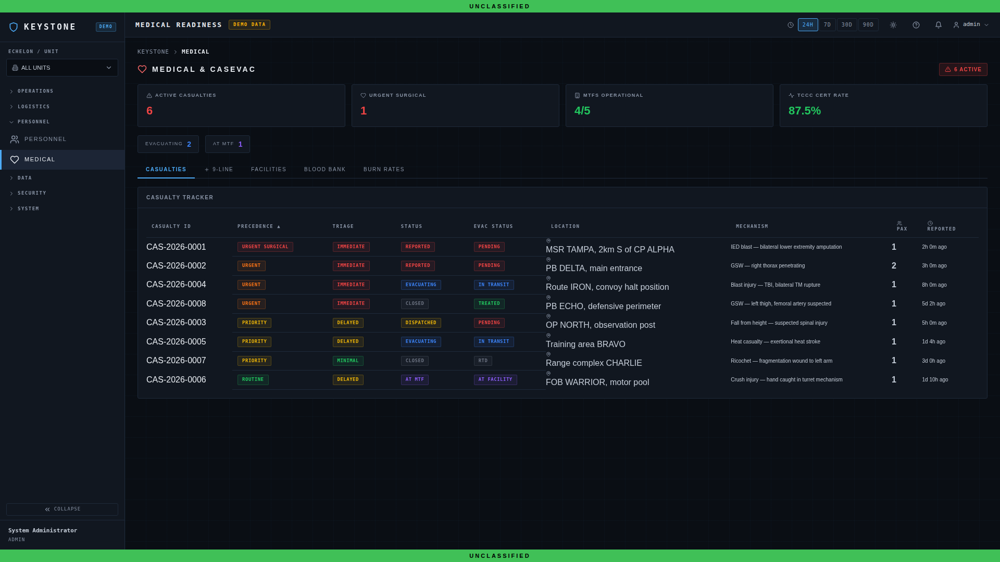

### Features

- **CASEVAC Events** — Track casualty reports with categories and status
- **Medical Treatment Facilities** — MTF status and capacity
- **Blood Product Inventory** — Blood type tracking with status indicators

---

## Data Ingestion

Upload data from multiple sources for automated parsing and integration.

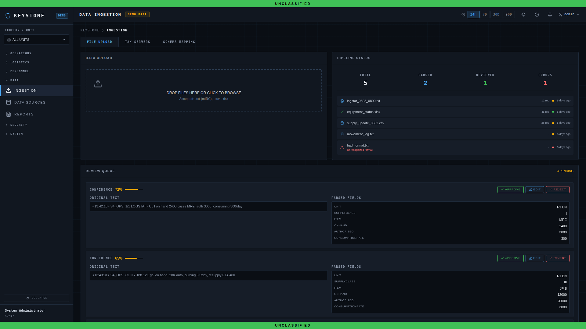

### Supported Formats

- **mIRC chat logs** — NLP + regex pipeline extracts supply, equipment, and convoy data
- **Excel spreadsheets** — Auto-matches known LOGSTAT templates; column mapping wizard for new formats
- **TAK CoT XML** — Field-submitted logistics data via Cursor-on-Target
- **Route files** — GeoJSON, GPX, KML, KMZ for map overlays

### Workflow

1. Drop files on the upload area or click to browse
2. KEYSTONE parses and maps data to the canonical schema
3. Review the ingestion history showing status and parsed record counts

---

## Data Sources

Configure external data source connections.

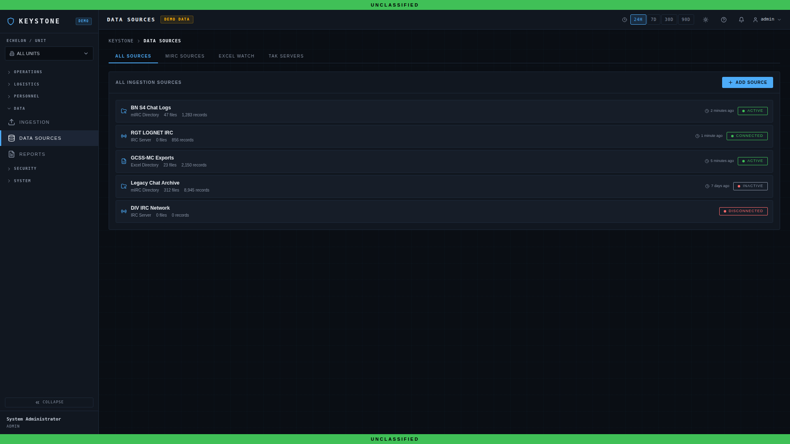

### Features

- **Connection status** indicators for each source
- **Source type** configuration (database, API, file system, TAK)
- **Last sync time** and sync frequency settings
- **Directory polling** for automated file ingestion

---

## Reports

Generate LOGSTATs, readiness reports, and operational summaries.

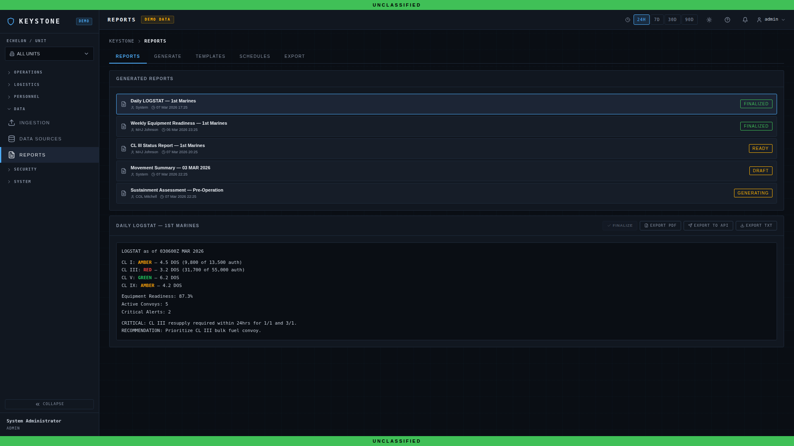

### Report Types

- LOGSTAT
- Readiness Report
- Supply Status
- Equipment Status
- Maintenance Summary
- Movement Summary
- Personnel Strength

### Workflow

1. Select report type, unit scope, and date range
2. Generate — report auto-populates from current data
3. Review in the structured viewer with type-specific sections
4. Finalize (DRAFT → READY → FINALIZED)
5. Export to text/JSON for offline distribution or higher HQ submission

---

## Alerts & Notifications

Automatic alerts for threshold breaches, readiness drops, convoy delays, and anomalies.

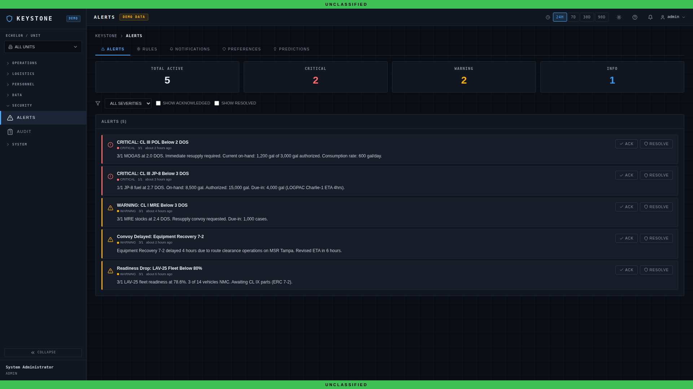

### Features

- **Three severity levels**: INFO, WARNING, CRITICAL
- **Automatic triggers**: Low DOS, low readiness, convoy delayed, anomaly detection
- **Configurable rules** — Set custom thresholds and notification preferences
- **Acknowledgement tracking** — Mark alerts as reviewed
- **Predictions tab** — ML-generated forecasts
- **Per-user notifications** with in-app bell, email, and desktop options

---

## Audit Log

Complete accountability trail for every action in KEYSTONE.

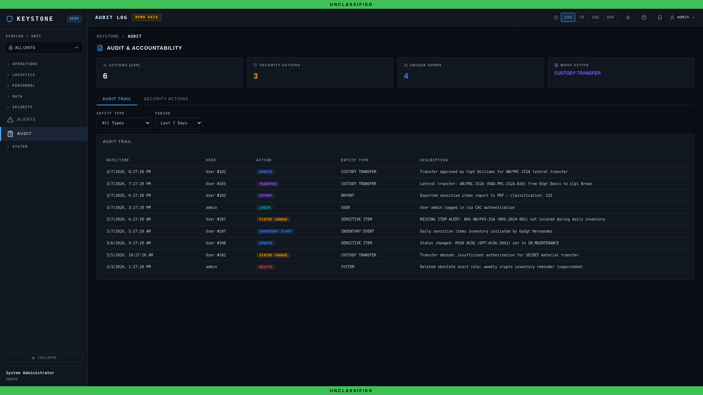

### Features

- **Every action logged**: Who did what, when, and to what entity
- **Color-coded action badges**: UPDATE, TRANSFER, EXPORT, LOGIN, DELETE
- **Filter by entity type** (equipment, supply, personnel, etc.) and time period
- **Exportable** for compliance and investigation

---

## Administration

System management for administrators.

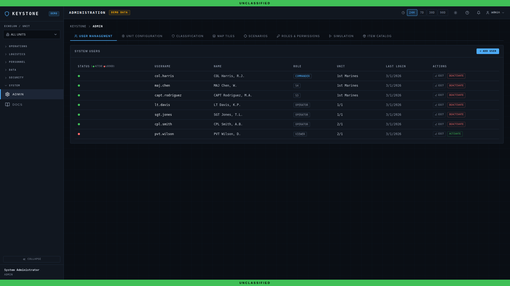

### Admin Tabs

- **User Management** — Create, edit, activate/deactivate users with role and unit assignment
- **Unit Hierarchy** — Interactive tree of the complete USMC organizational structure
- **Classification Settings** — Configure UNCLASSIFIED through TS//SCI with live banner preview
- **Map Tile Settings** — Configure tile layer sources for online and offline deployments
- **Scenarios** — Manage simulation exercises
- **Roles & Permissions** — Define access control policies
- **Sensitive Item Catalog** — Manage the sensitive item reference database

---

## Documentation

Built-in reference accessible from within the application.

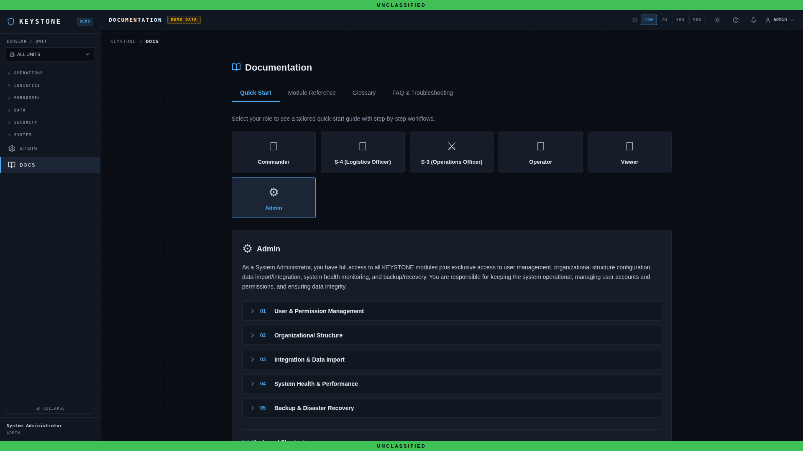

### Sections

- **Quick Start** — Role-specific guided workflows (Commander, S-4, S-3, Operator, Viewer, Admin)
- **Module Reference** — Technical documentation for each module
- **Glossary** — Military logistics terminology
- **FAQ & Troubleshooting** — Common questions and solutions

---

## Profile & Preferences

Customize your KEYSTONE experience.

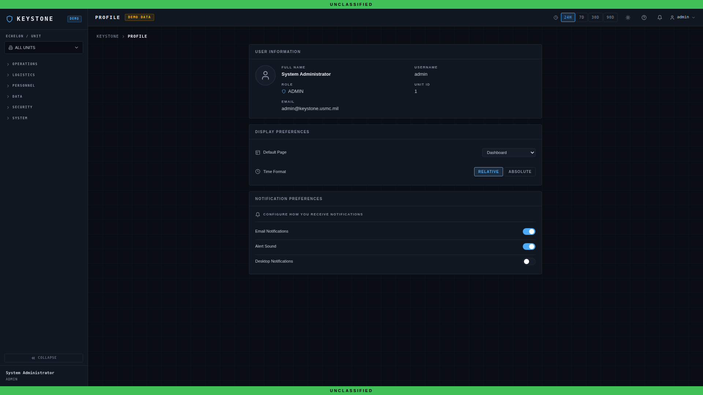

### Settings

- **User Information** — View your name, username, role, unit, and email
- **Default Page** — Choose which page loads after login (Dashboard, Map, Supply, etc.)
- **Time Format** — Toggle between relative ("5m ago") and absolute ("14:30:00Z") timestamps
- **Notification Preferences** — Enable/disable email notifications, alert sounds, and desktop notifications

---

## Keyboard Shortcuts

KEYSTONE supports keyboard navigation for power users:

| Shortcut | Action |
|----------|--------|
| `Ctrl+K` | Open Command Palette (global search) |
| `G` then `D` | Go to Dashboard |
| `G` then `M` | Go to Map |
| `G` then `S` | Go to Supply |
| `G` then `E` | Go to Equipment |
| `G` then `T` | Go to Transportation |
| `G` then `P` | Go to Personnel |
| `G` then `R` | Go to Reports |
| `G` then `A` | Go to Alerts |

The **Command Palette** (`Ctrl+K`) searches across pages, personnel, equipment, units, requisitions, and work orders with fuzzy matching.

---

## Troubleshooting

### Services won't start

```bash
./install.sh --status    # Check what's running
docker compose logs      # View all logs
docker compose logs backend --tail=50  # Backend-specific logs
```

### Login fails with "Invalid username or password"

Ensure `ENV_MODE=development` is set in `docker-compose.yml` under the backend environment. Then reset:

```bash
./install.sh --reset
```

### Self-signed certificate warning

This is expected in development. Click **Advanced → Proceed to localhost** in your browser.

### Port already in use

```bash
# Check what's using the port
sudo lsof -i :443
sudo lsof -i :8000

# Stop conflicting services or change ports in docker-compose.yml
```

### Frontend shows "Loading..." indefinitely

Check backend health and logs:

```bash
curl http://localhost:8000/health
docker compose logs backend --tail=30
```

### Database connection errors

```bash
# Verify PostgreSQL is running
docker compose exec db pg_isready -U keystone

# Full reset if corrupted
./install.sh --reset
```
