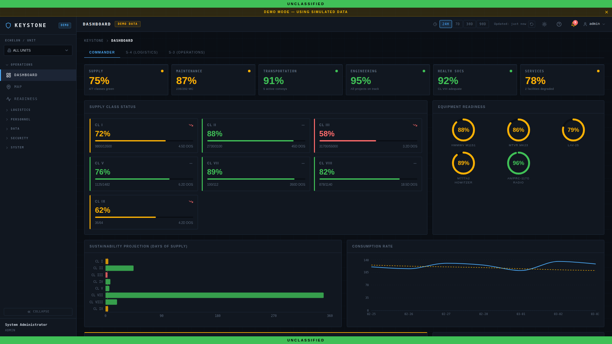
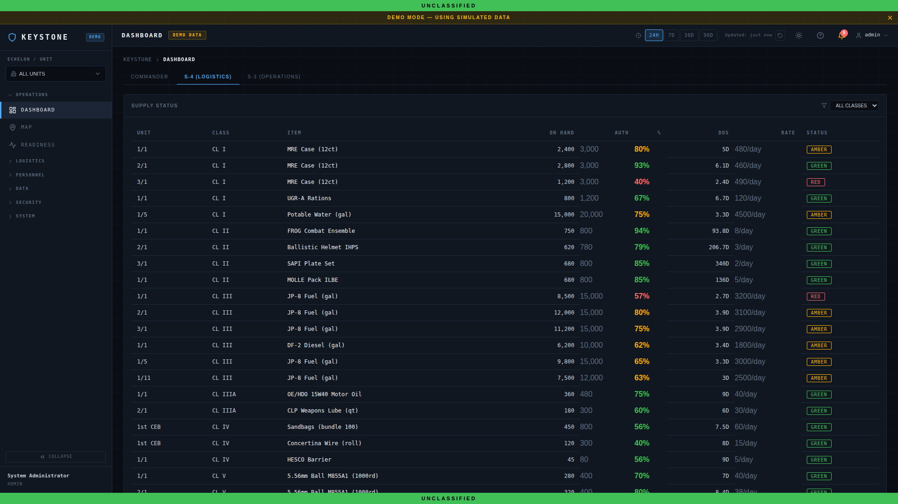
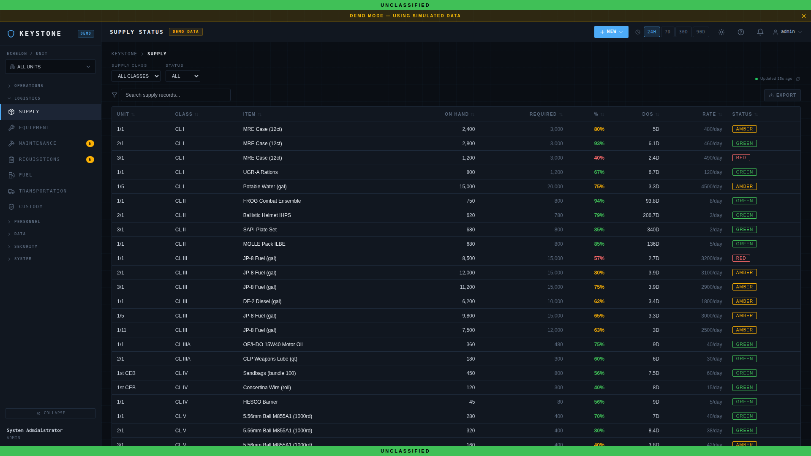
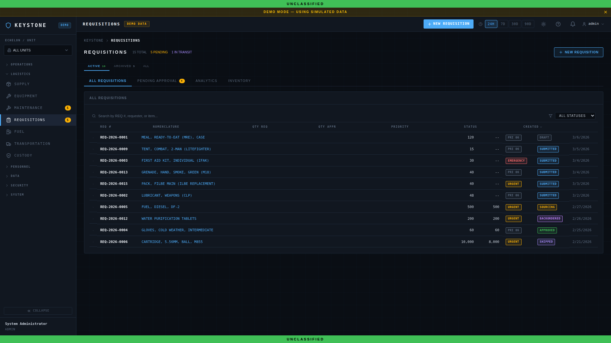
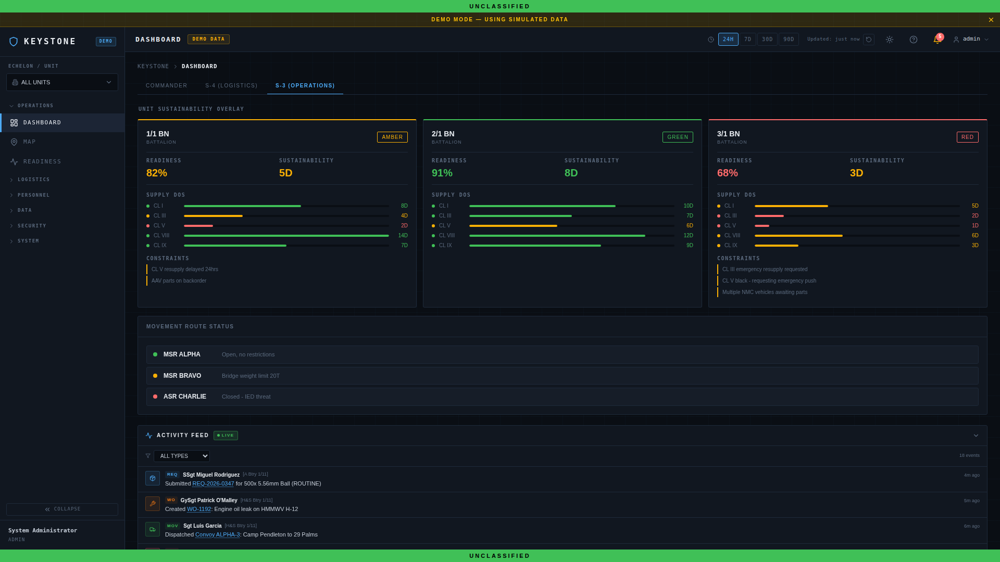
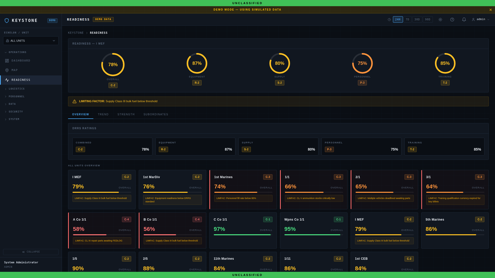
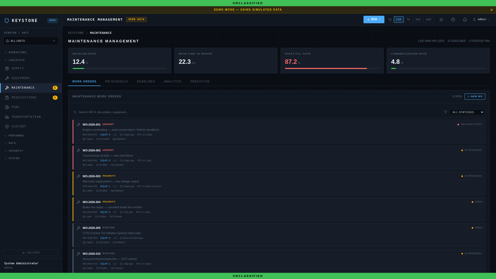
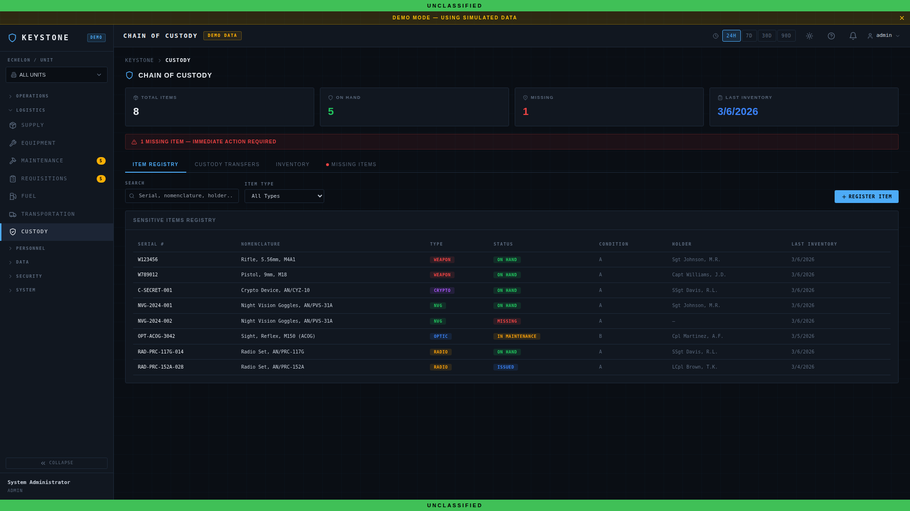
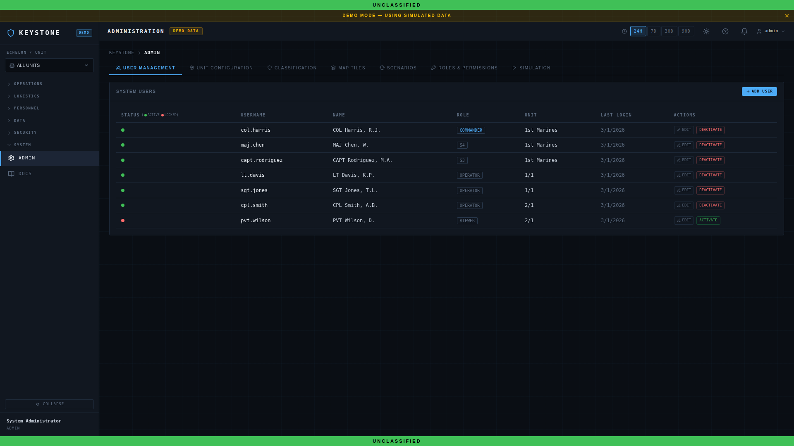
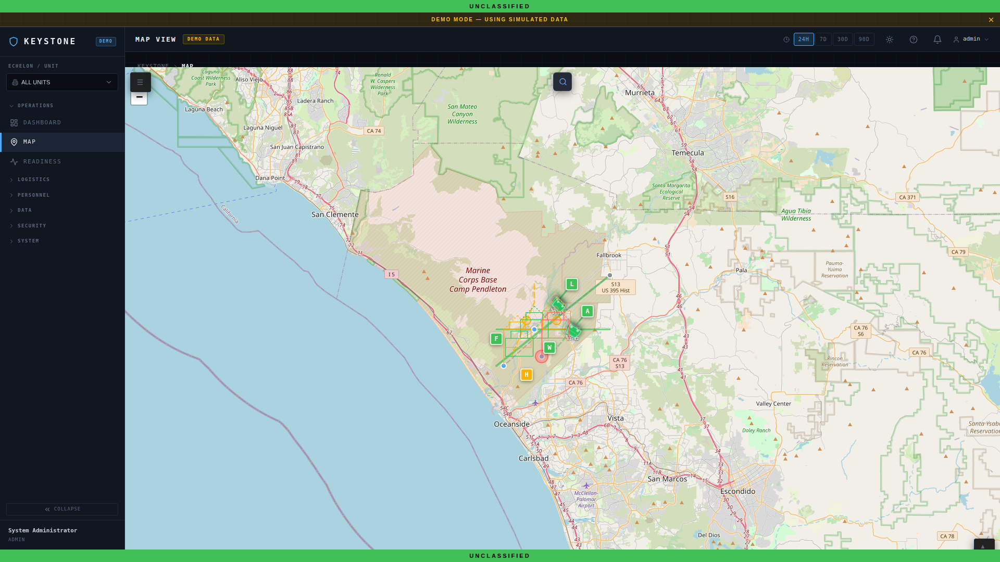

# KEYSTONE User Stories and Role Perspectives

> How every Marine in the logistics chain uses KEYSTONE to maintain combat readiness.

KEYSTONE is the USMC Logistics Common Operating Picture (LCOP) for battalion and regimental level units. It consolidates supply status, equipment readiness, maintenance tracking, weapons accountability, and operational planning into a single web-based platform. This document captures the perspective of every role in the system -- who they are, what they need, and how they use KEYSTONE in the course of a typical day.

---

## Roles Overview

| Role | Typical Billet | Primary Concern | Access Level |
|------|---------------|-----------------|--------------|
| **COMMANDER** | Battalion Commander (CO) | Combat readiness, sustainability, risk | Read-all, approve critical actions |
| **S4** | S-4 Logistics Officer | Supply posture, requisitions, distribution | Full logistics CRUD |
| **S3** | S-3 Operations Officer | Unit sustainability, movement, OPTEMPO | Read logistics, manage operations |
| **OPERATOR** | Logistics Chief / Motor-T Chief | Readiness ratings, maintenance, PMCS | Equipment and maintenance CRUD |
| **ARMORER** | Unit Armorer | Weapons accountability, custody, serial tracking | Armory module CRUD |
| **ADMIN** | S-6 / System Administrator | User accounts, access control, system health | Full system administration |
| **VIEWER** | Liaison Officer / Inspector / Senior Staff | Situational awareness | Read-only across all modules |

---

## 1. Battalion Commander (COMMANDER)

### Persona

**LtCol Marcus J. Reeves, USMC**
Billet: Commanding Officer, 1st Battalion, 1st Marines (1/1)
Unit: 1st Marine Division, I MEF, Camp Pendleton, CA

LtCol Reeves is responsible for the combat readiness of approximately 900 Marines and all organic equipment. He does not manage individual supply requisitions or work orders -- he needs to know, at a glance, whether his battalion can fight tonight. His primary concerns are overall equipment readiness rates, supply sustainability measured in days of supply (DOS), and any critical shortfalls that would degrade his ability to execute assigned missions. He briefs the Regimental Commander weekly and needs data he can trust without having to chase down his staff sections for clarification.

### User Stories

1. **As a COMMANDER, I want to see a single dashboard with KPI cards for overall readiness, supply levels, and personnel status**, so that I can assess my battalion's ability to execute its mission within 30 seconds of logging in.

2. **As a COMMANDER, I want to view equipment readiness rates broken down by type (wheeled, tracked, communications, weapons)**, so that I can identify which capability areas are degraded and direct staff attention accordingly.

3. **As a COMMANDER, I want to see a sustainability projection showing days of supply remaining across all classes**, so that I can determine whether my battalion can sustain operations through the planned OPTEMPO without emergency resupply.

4. **As a COMMANDER, I want to view supply class status at a summary level (CL I through CL IX)**, so that I can quickly identify which classes are below acceptable thresholds and task my S-4 to remediate.

5. **As a COMMANDER, I want to receive alerts when any readiness metric drops below a configurable threshold**, so that I am never surprised by a degraded capability during an operations brief.

6. **As a COMMANDER, I want to drill down from any KPI card to the underlying detail**, so that when the Regimental Commander asks a pointed question, I can provide specifics without calling my staff.

7. **As a COMMANDER, I want to see historical trend data for readiness and supply levels over the past 30/60/90 days**, so that I can identify whether conditions are improving or deteriorating and hold my staff accountable.

### A Day in KEYSTONE

LtCol Reeves opens KEYSTONE at 0545 before the morning battle update brief (BUB). The commander dashboard presents six KPI cards: overall equipment readiness (currently 87%), supply sustainability (6.2 DOS across all classes), maintenance backlog (14 open work orders), CL V ammunition status (92% of ASL), CL IX repair parts fill rate (78%), and personnel available-for-duty rate (94%). Two of the cards -- CL IX fill rate and maintenance backlog -- are highlighted in amber, indicating they have crossed the warning threshold he set at 80% and 10 work orders respectively. He taps the CL IX card and sees that LAV-25 transmission components are driving the shortfall; three requisitions are in a "backordered" status at the SSA. He makes a mental note to address this with the S-4 at the BUB.

During the BUB at 0700, LtCol Reeves pulls KEYSTONE up on the briefing room display. He reviews the equipment readiness donut charts, which show wheeled vehicles at 91%, tracked at 79%, and communications at 95%. The tracked vehicle dip correlates with the CL IX shortage he noted earlier. He reviews the sustainability projection chart, which forecasts that CL I (rations) drops below 3 DOS in 8 days if no resupply occurs -- aligned with a planned field exercise. He directs the S-4 to coordinate push logistics for CL I and to escalate the LAV transmission parts through the MEF G-4. Before closing the session, he glances at the supply class status summary to confirm CL V is still green across all ammunition DODICs. Satisfied, he moves on to the operations brief, confident in the data because it is the same system his staff maintains in real time.

### Screenshot

*The Commander dashboard provides an executive-level view of battalion readiness. Six KPI cards across the top surface the most critical metrics. Below, supply class status bars, equipment readiness donut charts by category, and a sustainability projection timeline give the CO everything needed for the morning BUB.*

---

## 2. S-4 Logistics Officer (S4)

### Persona

**Capt Danielle R. Ochoa, USMC**
Billet: Battalion S-4 (Logistics Officer), 1st Battalion, 1st Marines (1/1)
Unit: 1st Marine Division, I MEF, Camp Pendleton, CA

Capt Ochoa owns the logistics warfighting function for the battalion. She is responsible for supply management across all ten classes of supply, requisition tracking from submission to receipt, Class I meal cycle coordination, Class V ammunition management, and coordination with the Combat Logistics Battalion (CLB) for distribution. She juggles dozens of open requisitions at any time, must produce the daily LOGSTAT, and is the primary point of contact for every company-level supply representative. She needs a system that lets her see everything, filter quickly, and take action without switching between five different legacy spreadsheets.

### User Stories

1. **As an S4, I want to view a comprehensive supply status table with all items organized by supply class (CL I-IX)**, so that I can see the full logistics posture of the battalion in one place and identify shortfalls by class.

2. **As an S4, I want to search, filter, and sort the supply table by class, item name, NSN, or status**, so that I can quickly find specific items when a company commander calls with a question about a particular end item.

3. **As an S4, I want to export supply status data to CSV or PDF**, so that I can produce the daily LOGSTAT for submission to Regiment and attach it to the daily SITREP.

4. **As an S4, I want to view all open requisitions on a single page with tabs for pending approval, in-transit, and completed**, so that I can manage the full requisition lifecycle and identify any that have stalled.

5. **As an S4, I want to see requisition analytics showing average processing time, fill rate percentage, and aging requisitions**, so that I can identify systemic bottlenecks and brief the CO on supply chain performance.

6. **As an S4, I want to approve or reject requisitions submitted by subordinate units with the ability to add remarks**, so that I maintain fiscal responsibility and can redirect requests that should be sourced differently.

7. **As an S4, I want to visualize supply levels with charts and graphs alongside the raw data table**, so that I can brief the commander and the staff using visual aids rather than forcing them to interpret rows of numbers.

8. **As an S4, I want to receive notifications when any supply class drops below its minimum sustaining level**, so that I can initiate resupply actions before the shortfall impacts operations.

### A Day in KEYSTONE

Capt Ochoa logs into KEYSTONE at 0530 and navigates to the S-4 dashboard. The supply status table displays 25+ rows organized by supply class, each showing current on-hand quantity, authorized stockage level, reorder point, and status indicator. She scans the table from top to bottom -- CL I is green (7 DOS on hand), CL III POL is amber (4 DOS, below the 5 DOS threshold), CL V is green across all DODICs, and CL IX is red on three critical NSNs for MTVR brake assemblies. She clicks into the CL III row to see the detail and submits a bulk fuel request to the CLB through the requisition system. She then switches to the supply page, where the full supply table is displayed with search and export capabilities. She filters by "CL IX" and "RED" status, exports the result to CSV, and attaches it to her morning LOGSTAT message.

At 0800, after the BUB, Capt Ochoa returns to KEYSTONE and opens the Requisitions page. The Pending Approval tab shows four new requisitions: Alpha Company is requesting CL II organizational clothing for an incoming transfer, Bravo Company submitted a CL IX requisition for HMMWV alternators, Weapons Company wants CL V 40mm HE for a range, and H&S Company requested CL IV barrier material for a CP improvement project. She approves Alpha and Bravo immediately, adds a remark to Weapons Company that the 40mm allocation must be deducted from the quarterly training allowance, and rejects the CL IV request with a note to submit through the battalion engineer. She then checks the analytics tab, which shows the battalion's average requisition processing time is 3.2 days and the overall fill rate is 81%. She flags the two oldest aging requisitions -- both over 30 days -- for follow-up with the supporting SSA. By 0900, she has a complete picture of the battalion's supply posture and has taken action on every pending item.

### Screenshots

*The S-4 dashboard provides a detailed supply status table showing all classes of supply with on-hand quantities, authorized levels, and status indicators. This is the S-4's primary workspace for assessing the battalion's logistics posture.*

*The Supply page gives the S-4 the ability to search, filter, sort, and export the complete supply inventory. Integrated charts provide visual representations of supply levels for briefing purposes.*

*The Requisitions page consolidates all requisition management into one view. Tabs separate pending approvals from in-progress and completed requests. The analytics tab surfaces processing time, fill rates, and aging requisitions.*

---

## 3. S-3 Operations Officer (S3)

### Persona

**Maj Thomas K. Herrera, USMC**
Billet: Battalion S-3 (Operations Officer), 1st Battalion, 1st Marines (1/1)
Unit: 1st Marine Division, I MEF, Camp Pendleton, CA

Maj Herrera plans and coordinates all battalion operations, training, and tactical movements. While he does not manage supply directly, he is acutely aware that logistics drives operational tempo. He needs to know whether units have the sustainability to execute planned operations, whether convoys and movements are on track, and whether any logistics constraint will force him to modify the training schedule or operational plan. He is the bridge between the commander's intent and the staff's execution, and he relies on KEYSTONE to give him logistics context without having to interrupt the S-4.

### User Stories

1. **As an S3, I want to see a unit sustainability overlay showing days of supply by subordinate unit**, so that I can assess whether each company has sufficient logistics support to execute their assigned missions.

2. **As an S3, I want to view the status of all planned and in-progress movement routes (convoys, logistics patrols, administrative moves)**, so that I can deconflict with the operations calendar and identify delays that impact the scheme of maneuver.

3. **As an S3, I want to see a real-time activity feed of significant logistics events (critical shortfalls, completed resupply, equipment deadlined)**, so that I maintain situational awareness without polling the S-4 section.

4. **As an S3, I want to overlay unit logistics sustainability data onto operational planning timelines**, so that I can identify the "logistics culminating point" and recommend operational pauses or resupply windows to the CO.

5. **As an S3, I want to view equipment readiness by subordinate unit**, so that when I assign missions, I account for which units have the most combat-capable equipment sets.

6. **As an S3, I want to filter the activity feed by severity and type**, so that I can focus on operationally significant logistics events and ignore routine transactions during high-tempo periods.

7. **As an S3, I want to export a logistics summary for inclusion in the daily OPORD or FRAGO**, so that subordinate units receive accurate logistics overlays with their operational orders.

### A Day in KEYSTONE

Maj Herrera opens KEYSTONE at 0600 during his morning routine. He navigates directly to the S-3 operations dashboard, which presents the unit sustainability overlay as its centerpiece. The overlay shows all five subordinate units (A Co, B Co, C Co, W Co, H&S Co) with their current days of supply across critical classes. Alpha Company, currently forward-deployed to a training area at Twentynine Palms, shows 3 DOS for CL I and 2 DOS for CL III -- both below the 4 DOS planning threshold for sustained operations. He notes this immediately: the CL III shortfall means Alpha's vehicle operations will be constrained within 48 hours if not resupplied.

Below the sustainability overlay, the movement route status panel shows three active logistics movements: a CL I push from the CLB to Alpha Company (status: en route, ETA 1400), a CL IX parts delivery from the SSA to the Motor-T lot (status: complete), and a retrograde convoy from Bravo Company returning excess CL V to the ASP (status: scheduled for tomorrow 0600). The activity feed on the right side of the dashboard shows that two MTVRs in Charlie Company were deadlined this morning for transmission faults, and that Weapons Company received a complete CL V resupply yesterday afternoon. Maj Herrera uses the activity feed to build his logistics slide for the 0700 BUB. During the brief, he recommends to LtCol Reeves that the planned Alpha Company live-fire exercise be shifted 24 hours right to allow the CL III resupply to arrive and be distributed. The CO concurs, and Maj Herrera issues a FRAGO through the operations section, exporting the logistics summary from KEYSTONE as an annex.

### Screenshot

*The S-3 operations dashboard connects logistics data to operational planning. The unit sustainability overlay shows each subordinate unit's supply posture, movement route status tracks convoys and logistics movements, and the activity feed provides a real-time stream of significant logistics events.*

---

## 4. Logistics Operator (OPERATOR)

### Persona

**GySgt William D. Patterson, USMC**
Billet: Motor Transport Chief / Logistics Chief, 1st Battalion, 1st Marines (1/1)
Unit: H&S Company, 1/1, Camp Pendleton, CA

GySgt Patterson is the senior enlisted logistics Marine in the battalion. He runs the Motor-T section, manages equipment readiness, and oversees all maintenance operations. He lives and breathes PMCS (Preventive Maintenance Checks and Services), work orders, deadline reports, and parts chasing. He knows every vehicle in the battalion by bumper number, knows which ones are waiting on parts, and can tell you off the top of his head which equipment is approaching its scheduled service interval. He needs a system that tracks readiness ratings, manages work orders efficiently, and gives him the metrics to hold his mechanics accountable.

### User Stories

1. **As an OPERATOR, I want to view DRRS (Defense Readiness Reporting System) ratings for all battalion equipment categories**, so that I can report accurate readiness data to the S-4 and identify which categories are pulling overall readiness down.

2. **As an OPERATOR, I want to see all subordinate units' C-level ratings (C1 through C4) at a glance**, so that I can prioritize maintenance support to the units with the lowest readiness and the most upcoming operational commitments.

3. **As an OPERATOR, I want to manage work orders with full lifecycle tracking (open, in-progress, awaiting parts, completed)**, so that every maintenance action is documented and nothing falls through the cracks.

4. **As an OPERATOR, I want to see KPI cards for deadline rate, mean time to repair (MTTR), and parts fill rate**, so that I can measure my section's performance and brief trends to the S-4 and CO.

5. **As an OPERATOR, I want to filter the work order queue by equipment type, priority, and status**, so that I can run the morning maintenance meeting efficiently by reviewing only critical or overdue items.

6. **As an OPERATOR, I want to log PMCS results for each piece of equipment**, so that there is a digital record of operator-level maintenance and I can identify equipment that consistently fails the same checks.

7. **As an OPERATOR, I want to receive alerts when equipment is approaching a scheduled service interval or when a deadline condition is reported**, so that I can plan maintenance bay time and parts ordering proactively rather than reactively.

8. **As an OPERATOR, I want to see parts on order for each open work order**, so that I can follow up on CL IX requisitions and give mechanics an accurate timeline for when they can resume repairs.

### A Day in KEYSTONE

GySgt Patterson arrives at the Motor-T lot at 0530 and opens KEYSTONE on the maintenance bay's wall-mounted terminal. He goes straight to the Readiness page. The DRRS section shows the battalion's overall equipment readiness at 87%. Below that, unit-level C-ratings are displayed for all subordinate elements: Alpha Company is C2 (degraded due to two deadlined HMMWVs), Bravo Company is C1, Charlie Company is C3 (three deadlined MTVRs and a LAV-25 in the maintenance cycle), Weapons Company is C1, and H&S Company is C2. Charlie Company is his priority today. He taps into Charlie's detail and sees the three MTVRs: one is awaiting a transmission (CL IX on order, ETA 4 days), one has a completed work order pending QC inspection, and one was just inducted yesterday for a cooling system fault. He assigns the QC inspection to his senior mechanic and schedules bay time for the cooling system diagnosis.

At 0630, GySgt Patterson switches to the Maintenance page for his daily maintenance meeting. The KPI cards show: deadline rate at 8.3% (amber -- his threshold is 7%), MTTR at 4.2 days (green), and parts fill rate at 76% (red -- well below the 85% target). He knows the parts fill rate is being dragged down by the same LAV-25 transmission components the CO flagged at yesterday's BUB. He filters work orders by "Awaiting Parts" status and sees seven items. He cross-references with the S-4's requisition tracker and confirms that three of the seven have parts inbound within the week. He updates the work order notes for each, prints the filtered list for his mechanics, and briefs his Marines on the day's priorities. By 0700, every mechanic knows what they are working on, what parts are available, and what the expected completion timeline is. GySgt Patterson checks KEYSTONE twice more during the day -- once after lunch to verify the QC inspection was completed and the MTVR was returned to Charlie Company, and once at end of day to update the deadline report before the evening LOGSTAT.

### Screenshots

*The Readiness page displays DRRS ratings at the top with overall equipment readiness, followed by a unit-by-unit breakdown of C-level ratings. This gives the Logistics Operator an immediate view of which units are fully mission capable and which need maintenance attention.*

*The Maintenance page is the OPERATOR's primary workspace. KPI cards surface the three metrics that matter most to a Motor-T Chief: deadline rate, mean time to repair, and parts fill rate. Below, the work order queue is filterable by status, type, and priority.*

---

## 5. Unit Armorer (ARMORER)

### Persona

**Sgt Michael A. Trujillo, USMC**
Billet: Unit Armorer, 1st Battalion, 1st Marines (1/1)
Unit: H&S Company, 1/1, Camp Pendleton, CA
MOS: 2111 (Small Arms Repairer/Technician)

Sgt Trujillo is responsible for the accountability, custody, and maintenance of every serialized weapon in the battalion -- rifles, pistols, machine guns, grenade launchers, mortars, and anti-armor weapons. Weapons accountability is zero-defect; a single unaccounted weapon is a career-ending event and a reportable security incident. He conducts daily inventory counts, manages custody transfers when Marines change units or deploy, and maintains the weapons maintenance log. He needs a system that tracks every serial number, shows who has custody, and immediately flags any discrepancy.

### User Stories

1. **As an ARMORER, I want to maintain a digital item registry of all serialized weapons with serial number, weapon type, assigned unit, and custody holder**, so that I have a single authoritative source for weapons accountability that replaces the paper weapons cards (DA Form 2062).

2. **As an ARMORER, I want to receive an immediate alert when any item is flagged as missing or unaccounted for**, so that I can initiate the missing weapon/sensitive item report (SIR) procedure without delay.

3. **As an ARMORER, I want to transfer custody of a weapon from one Marine to another with a digital audit trail**, so that every hand receipt action is logged and I can prove chain of custody at any point in time.

4. **As an ARMORER, I want to search the registry by serial number, weapon type, unit, or custodian name**, so that when the battalion XO asks about a specific weapon, I can provide an answer in seconds.

5. **As an ARMORER, I want to see a summary count of all weapons by type and status (serviceable, unserviceable, in maintenance, missing)**, so that I can produce the weekly sensitive items inventory report accurately and quickly.

6. **As an ARMORER, I want to log maintenance actions against individual serialized weapons**, so that I maintain a per-weapon maintenance history that informs inspection schedules and replacement recommendations.

7. **As an ARMORER, I want to generate a printable custody report for physical signature during inventories and change-of-custody events**, so that I maintain the paper trail required by regulation alongside the digital record.

### A Day in KEYSTONE

Sgt Trujillo opens the armory at 0500 and logs into KEYSTONE before the first Marines arrive to draw weapons for the morning range. He navigates to the Custody page and reviews the item registry. The registry shows 8 items currently displayed (a filtered view of his section's high-priority items), with columns for serial number, weapon type, assigned unit, custodian, and status. He immediately notices the missing item alert banner at the top of the page -- an M4A1, serial number W349871, was flagged as unaccounted for during last night's inventory reconciliation. He checks the audit log and sees that the weapon was last signed out to a Marine in Bravo Company who transferred to 2d Marine Division three days ago. He contacts Bravo Company's supply sergeant, who confirms the Marine turned in the weapon to the Bravo armory sub-custodian but the transfer was never logged in KEYSTONE. Sgt Trujillo executes the custody transfer in the system, the alert clears, and the registry shows the weapon back in the main armory's custody. Crisis averted -- but it reinforces why the digital audit trail matters.

From 0600 to 0700, Marines from Charlie Company arrive to draw weapons for a live-fire range. Sgt Trujillo processes each draw in KEYSTONE: he scans or enters the serial number, selects the receiving Marine from the roster, and the system creates a custody record timestamped to the second. When the Marines return at 1500, he processes each turn-in the same way, verifying the serial number matches the draw record. At the end of the day, he runs the daily inventory count against the KEYSTONE registry -- every serial number accounted for, every custodian verified. He generates the daily sensitive items report and archives it. Zero discrepancies. He locks the armory at 1630, confident that if the battalion were to receive an IG inspection tomorrow, every weapon in the battalion could be accounted for with a complete chain of custody in KEYSTONE.

### Screenshot

*The Custody page is the armorer's mission-critical workspace. The item registry displays all serialized weapons with serial numbers, assigned custodians, and status. The missing item alert banner immediately surfaces accountability discrepancies for rapid resolution.*

---

## 6. System Administrator (ADMIN)

### Persona

**SSgt Jason L. Nakamura, USMC**
Billet: Battalion S-6 (Communications/IT) NCOIC / System Administrator
Unit: H&S Company, 1/1, Camp Pendleton, CA
MOS: 0631 (Network Administrator)

SSgt Nakamura manages the technical infrastructure that KEYSTONE runs on and is the system administrator responsible for user accounts, role assignments, and access control. He does not need to understand the intricacies of CL IX parts tracking, but he must ensure that the right people have the right access, that the system is available during operational hours, and that any access anomalies are investigated. He is the first call when someone cannot log in, when a new Marine needs an account, or when a departing Marine's access must be revoked. He answers to both the S-6 officer and the S-4 for system availability and data integrity.

### User Stories

1. **As an ADMIN, I want to manage user accounts (create, modify, disable, delete) from a central user management interface**, so that I can onboard new Marines, update billets, and revoke access for departures efficiently.

2. **As an ADMIN, I want to assign and modify roles (ADMIN, COMMANDER, S4, S3, OPERATOR, ARMORER, VIEWER) for each user**, so that every Marine has access commensurate with their billet and no more.

3. **As an ADMIN, I want to see a user management table showing all active accounts with their assigned role, unit, and last login timestamp**, so that I can audit access and identify dormant accounts for deactivation.

4. **As an ADMIN, I want to enforce the principle of least privilege by restricting role assignment to predefined roles**, so that access control remains standardized and auditable across the battalion.

5. **As an ADMIN, I want to view an audit log of all administrative actions (account creation, role changes, access revocations)**, so that I can satisfy IA (Information Assurance) inspection requirements and investigate any unauthorized access.

6. **As an ADMIN, I want to reset a user's password or unlock a locked account without needing to involve external IT support**, so that I can resolve access issues quickly and minimize downtime for the end user.

7. **As an ADMIN, I want to see system health indicators (uptime, database status, service connectivity)**, so that I can proactively address infrastructure issues before they impact operational users.

### A Day in KEYSTONE

SSgt Nakamura checks KEYSTONE system health at 0600 as part of his morning IT checks. He logs in with his ADMIN account and navigates to the Admin page. The user management table displays all seven current users with their role badges (ADMIN, COMMANDER, S4, S3, OPERATOR, ARMORER, VIEWER), assigned units, and last login times. He notices that one account -- a VIEWER assigned to the Regiment LNO -- has not logged in for 45 days. He flags it for follow-up and sends a message to the LNO's section to confirm whether the account should remain active. Per the battalion's IA policy, accounts inactive for 60 days are disabled automatically, but SSgt Nakamura prefers to get ahead of it.

At 0730, the S-4 sends him a request: a new Corporal has reported to the Motor-T section and needs OPERATOR access. SSgt Nakamura creates the account, assigns the OPERATOR role, sets a temporary password, and sends the credentials to the Marine's NCOIC. The entire process takes two minutes. Later that afternoon, he receives word that GySgt Patterson is transferring to 2d Battalion, 1st Marines next week. SSgt Nakamura prepares by noting the account for deactivation on the transfer date. He will not disable it early -- GySgt Patterson needs access through his final day to complete turnover -- but he sets a calendar reminder. At the end of the day, he reviews the admin audit log to confirm that no unauthorized role changes occurred. Every action -- the account creation, the role assignment, his own login -- is logged with timestamp, acting user, and action description. He archives the daily log extract as required by the battalion IA SOP and moves on to his other S-6 responsibilities.

### Screenshot

*The Admin page provides the system administrator with a comprehensive user management table. Each user's role is displayed as a color-coded badge for quick identification. The table shows all active accounts, making it straightforward to audit access and manage the user lifecycle.*

---

## 7. Read-Only Viewer (VIEWER)

### Persona

**Maj Christine E. Laporte, USMC**
Billet: Regimental Logistics Liaison Officer (LNO) to 1st Battalion, 1st Marines
Unit: 1st Marine Regiment, 1st Marine Division, Camp Pendleton, CA

Maj Laporte is the Regiment's eyes into 1/1's logistics posture. She does not manage supply or maintenance for the battalion -- that is the battalion staff's job. Her role is to monitor, report, and advise. She needs visibility into the battalion's supply levels, readiness rates, and unit positions so she can brief the Regimental Commander and coordinate support from the Combat Logistics Regiment when the battalion's organic capabilities are insufficient. She also uses KEYSTONE when preparing for or conducting logistics inspections. She cannot modify any data, and she should not be able to -- her value is objectivity, and her access must reflect that.

### User Stories

1. **As a VIEWER, I want to see the battalion's unit positions on a map with military symbology markers**, so that I can understand the physical disposition of the battalion and overlay it with logistics data for the Regimental LCOP.

2. **As a VIEWER, I want to access the same dashboard views as the Commander and S-4 in read-only mode**, so that I can independently verify readiness data without relying on the battalion staff's verbal reports.

3. **As a VIEWER, I want to view supply status, readiness ratings, and maintenance data without the ability to edit**, so that I can produce accurate reports for Regiment while ensuring the battalion's data integrity is never at risk from my access.

4. **As a VIEWER, I want to view the map with Camp Pendleton terrain, unit locations, and logistics nodes**, so that I can assess distribution distances, MSR (Main Supply Route) usage, and the spatial relationship between supported and supporting units.

5. **As a VIEWER, I want to export or screenshot map views and dashboard data**, so that I can include KEYSTONE data in the Regimental daily SITREP and logistics synchronization briefs.

6. **As a VIEWER, I want to see the same data as other roles without any delay or reduced fidelity**, so that my reports to Regiment reflect the true current state rather than a stale or filtered subset.

### A Day in KEYSTONE

Maj Laporte logs into KEYSTONE at 0630 from the Regimental CP. She opens the map view, which displays Camp Pendleton with military symbology markers showing the positions of 1/1's subordinate units. Alpha Company is plotted forward at Range 400, Bravo and Charlie Companies are in the main cantonment area, and Weapons Company is at the mortar range complex. She zooms into Alpha Company's position and cross-references with the sustainability overlay from the S-3 dashboard to confirm that Alpha's forward position has adequate DOS for the current exercise. The map also shows a logistics convoy icon along the MSR between the CLB and Alpha's position, which aligns with the CL I push she knows is scheduled for today.

At 0900, Maj Laporte opens the commander-level dashboard to review 1/1's overall readiness posture. She sees the same KPI cards that LtCol Reeves sees -- overall equipment readiness, sustainability, maintenance backlog -- but she cannot click "approve" or "edit" on anything. This is by design. She copies the key figures into her daily report to the Regimental S-4: "1/1 overall equipment readiness 87%, CL IX fill rate 78% (degraded, primary driver LAV-25 transmission components), sustainability 6.2 DOS, three MTVRs deadlined in C Co." She then checks the supply status table to verify the CL III situation she heard about from the CLB, confirms the fuel DOS figure matches what the CLB reported, and closes KEYSTONE. Her entire session took 20 minutes. She uses KEYSTONE two to three more times during the day as questions come in from the Regimental staff, each time pulling objective, real-time data directly from the source rather than waiting for the battalion to send a formatted report.

### Screenshot

*The Map view displays Camp Pendleton with military symbology markers showing unit positions, logistics nodes, and movement routes. This is the primary view for VIEWER role users who need spatial context for logistics situational awareness.*

---

## Appendix: Role-Permission Matrix

| Capability | ADMIN | COMMANDER | S4 | S3 | OPERATOR | ARMORER | VIEWER |
|------------|:-----:|:---------:|:--:|:--:|:--------:|:-------:|:------:|
| View dashboards | X | X | X | X | X | X | X |
| View map | X | X | X | X | X | X | X |
| View supply status | X | X | X | X | X | -- | X |
| Manage supply data | -- | -- | X | -- | -- | -- | -- |
| Manage requisitions | -- | -- | X | -- | -- | -- | -- |
| View readiness | X | X | X | X | X | -- | X |
| Manage maintenance | -- | -- | -- | -- | X | -- | -- |
| View operations | X | X | X | X | X | -- | X |
| Manage operations | -- | -- | -- | X | -- | -- | -- |
| Manage armory/custody | -- | -- | -- | -- | -- | X | -- |
| View armory/custody | X | X | X | -- | -- | X | X |
| Manage users/roles | X | -- | -- | -- | -- | -- | -- |
| View audit logs | X | X | -- | -- | -- | -- | -- |
| Export data | X | X | X | X | X | X | X |

---

*This document reflects KEYSTONE as of 2026-03-07. User stories and personas are representative of typical USMC logistics billets and workflows at the battalion level. Actual unit designations, personnel, and readiness figures are illustrative.*
